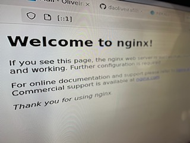
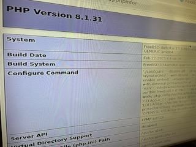
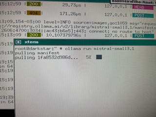
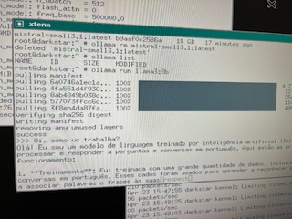

<!-- ABOUT THE PROJECT -->

# Servidor de configura&ccedil;&atilde;o autom&aacute;tica (ACS) como ferramenta para um sistema multiagentes (MAS).

## Pr&eacute;-requisitos do sistema

### Plataformas compat&iacute;veis

* FreeBSD 11.1 ou posterior
* GNU/Linux portando o kernel 5 ou posterior

### Nginx

O Nginx &eacute; um servidor web que pode funcionar como um proxy reverso, encaminhando solicita&ccedil;&otilde;es de clientes para o PHP-FPM e retornando as respostas processadas de volta para os clientes.



```sh
server {
#listen 80;
listen [::1]:80;
server_name dominio.exemplo.br computador.dominio.exemplo.br;
error_page 500 502 503 504 /50x.html;
location = /50x.html {
root /usr/local/www;
}
error_page 404 402 403 404 /40x.html;
location = /40x.html {
root /usr/local/www;
}
location / {
root /usr/local/www;
index index.html;
}
...
```

```sh
location ^~ /phpPgAdmin {
alias /usr/local/www/phpPgAdmin;
index index.php;
location ~ \.php$ {
root /usr/local/www;
include fastcgi_params;
fastcgi_param SCRIPT_FILENAME $document_root$fastcgi_script_name;
fastcgi_pass [::1]:19999;
} }
```

### PHP-FPM

O “PHP FastCGI Process Manager,” &eacute; um gerenciador de processos FastCGI avan&ccedil;ado e de alto desempenho para PHP.

```sh
[www]
user = www
group = www
listen = [::1]:19999
listen.owner = www
listen.group = www
listen.mode = 0440
...
```



### O protocolo tr-069 integrado ao PHP

_A api realiza a leitura e a configura&ccedil;&atilde;o dos par&acirc;metros das CPEs com o uso de envelopes SOAP (Simple Object Access Protocol) e uma estrutura XML (Extensive Markup Language)._

```sh
<soap:Envelope xmlns:soap="http://schemas.xmlsoap.org/soap/envelope/"
               xmlns:cwmp="urn:dslforum-org:cwmp-1-0"
               soap:encodingStyle="http://schemas.xmlsoap.org/soap/encoding/">
<soap:Header>
<cwmp:ID mustUnderstand="1">$ID</cwmp:ID>    
</soap:Header>
<soap:Body>
<cwmp:GetRPCMethods></cwmp:GetRPCMethods>
</soap:Body>
</soap:Envelope>
```

# ...em desenvolvimento

### Ollama

O Ollama &eacute; uma ferramenta de c&oacute;digo aberto que executa large language models (LLMs) diretamente em um computador.

_Requisitos de hardware_

* 1-8 n&uacute;cleo(s) de CPU
* 1-16Gb de mem&oacute;ria RAM
* 128Gb de storage

### Ollama como api

```sh
# ollama run mistral-small3.1
```



```sh
# ollama run llama3:8b
```



### Implementa&ccedil;&atilde;o do LangChain
_LangChain &eacute; uma biblioteca para criar aplica&ccedil;&otilde;es de linguagem natural, facilitando o desenvolvimento de sistemas que interagem com linguagem natural, neste modelo faremos uso do LangChain-Ollama como complemento ou extens&atilde;o da LangChain projetado para integrar com o Ollama._

# ...em desenvolvimento
# Site

_Vulnerabilidades de seguran&ccedil;a s&atilde;o inevit&aacute;veis, mas &eacute; poss&iacute;vel lidar com elas de forma respons&aacute;vel, dessa forma a escolha do sistema operacional pode impactar na experi&ecirc;ncia do usu&aacute;rio, na seguran&ccedil;a e na efici&ecirc;ncia das opera&ccedil;&otilde;es._

![Slackware]

_Slackware &eacute; uma distribui&ccedil;&atilde;o GNU/Linux mantida ainda em evid&ecirc;ncia, com uma meta de produ&ccedil;&atilde;o da distribui&ccedil;&atilde;o baseada em simplicidade e estabilidade, alcan&ccedil;ando o padr&atilde;o de distribui&ccedil;&atilde;o mais Unix-like ao manter seus usu&aacute;rios nas camadas de configura&ccedil;&atilde;o em console de modo texto para uma total personaliza&ccedil;&atilde;o do ambiente. O Kernel da s&eacute;rie 5.15.x, escolhido para esta distro, tem "manuten&ccedil;&atilde;o de longo prazo"._

![Kernel]

[Kernel]: assets/images/propaganda/tux.png
[Slackware]: assets/images/propaganda/slackware-linux.png
